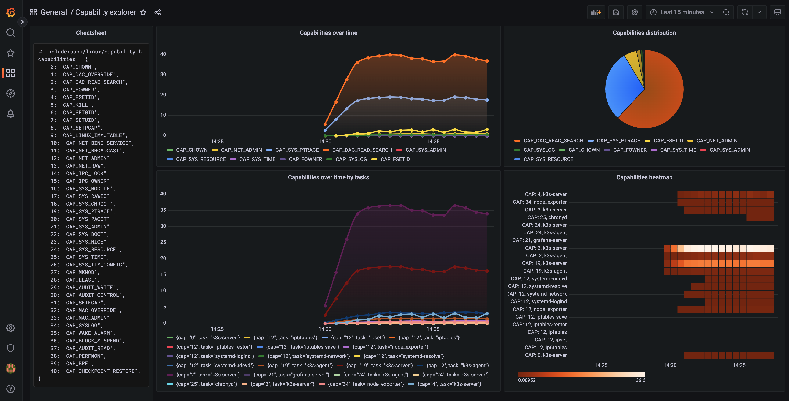

# Find out what your processes are CAPable of with eBPF!

## Prerequisites

Linux kernel version 5.8+

## Installing BumbleBee

First, download BumbleBee:

```console
curl -sL https://run.solo.io/bee/install | BUMBLEBEE_VERSION=v0.0.12 sh
mv $HOME/.bumblebee/bin/bee /usr/local/bin
```

## Packaging the BPF code

Package `capable` as an OCI image:

```console
bee build capable.c capable:v1
```

Now, you can list the images that you built:

```console
bee list
```

This should give you an output similar to this:

```console
Name       | OS    | OS Version      | Arch  
capable:v1 | Linux | 5.11.0-1026-gcp | x86_64
```

Finally, you can run it:

```console
bee run capable:v1
```

And check the results in a TUI interface:

```console
 __                                                                                                            
/\ \                                                   Program location: capable:v1                            
\ \ \____     __     __                                                                                        
 \ \ '__'\  /'__'\ /'__'\                      // \                                                            
  \ \ \L\ \/\  __//\  __/                      \\_/ //                                                         
   \ \_,__/\ \____\ \____\   ''-.._.-''-.._.. -(||)(') <ctrl-n>   Select next table                            
    \/___/  \/____/\/____/                     '''     <ctrl-p>   Select previous table                        
                                                       <ctrl-c>   Quit                                         
                                  (powered by solo.io)                                                         
                                                                                                               
╔═══════════════════════════════════════════════════events════════════════════════════════════════════════════╗
║cap                 pid                  task                       tgid                 uid                 ║
║2                   2150                 k3s-server                 2336                 0                   ║
║2                   2150                 k3s-server                 2336                 0                   ║
║2                   2150                 k3s-server                 2336                 0                   ║
║2                   2150                 k3s-server                 2336                 0                   ║
║19                  2150                 k3s-server                 2336                 0                   ║
...
...
...
```

## Deploying it in a Kubernetes cluster

> Note: an OCI compliant registry is recommended for this step. This example expects a local registry to be running on localhost:5000, but feel free to use other solutions, e.g. GitHub Container Registry (ghcr.io), or similar.

Let's push the image to a registry:

```console
bee push localhost:5000/solo/capable:v1
```

Now, let's deploy it as a Daemonset:

```yaml
cat << EOF | kubectl apply -f -
apiVersion: apps/v1
kind: DaemonSet
metadata:
  name: bumblebee
spec:
  selector:
    matchLabels:
      app: bumblebee
  template:
    metadata:
      labels:
        app: bumblebee
    spec:
      containers:
      - name: bumblebee
        image: ghcr.io/solo-io/bumblebee/bee:0.0.12
        imagePullPolicy: Always
        command: ["./bee-linux-amd64"]
        args: ["run", "--insecure", "--plain-http", "--no-tty", "master:5000/solo/capable:v1"]
        tty: true
        ports:
        - name: http-monitoring
          containerPort: 9091
        securityContext:
          privileged: true
EOF
```

> Note: The Operator distribution will be [soon available](https://github.com/solo-io/bumblebee/pull/90), making it easier to deploy various eBPF scripts into your Kubernetes cluster.

## Installing Prometheus stack and scraping the bee pods

```console
helm repo add prometheus-community https://prometheus-community.github.io/helm-charts
helm repo update

helm upgrade --install kube-prometheus-stack \
prometheus-community/kube-prometheus-stack \
--version 41.5.1 \
--namespace monitoring \
--create-namespace
```

Deploy a podMonitor to scrape our BumbleBee pods:

```console
cat << EOF | kubectl apply -f -
apiVersion: monitoring.coreos.com/v1
kind: PodMonitor
metadata:
  name: bumblebee-podmonitor
  labels:
    monitoring: bumblebee
    release: kube-prometheus-stack
spec:
  selector:
    matchLabels:
      app: bumblebee
  jobLabel: bumblebee-stats
  podMetricsEndpoints:
  - port: http-monitoring
    path: /metrics
    interval: 15s
EOF
```

## The Grafana dashboard

You can find a dashboard in the `dashboards/` folder, named `cap.json`.

Once you imported it into Grafana, you should be able to monitor all the capabilities invoked by your processes.


